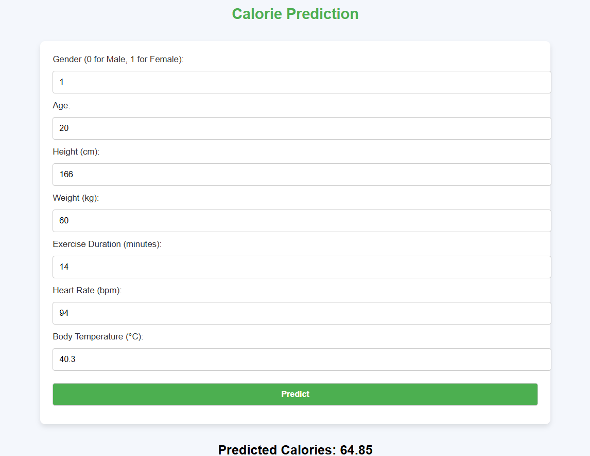

## **Calorie Prediction API Using Flask and XGBoost**

This repository contains a Flask-based API for predicting calories burned during exercise based on user input data such as gender, age, weight, height, heart rate, and exercise duration. The machine learning model used is an XGBoost regression model.

### **Project Overview**
This project includes:
- **Flask API**: A simple web API built using Flask to handle user input and return calorie predictions.
- **Machine Learning Model**: XGBoost model trained on exercise and calorie datasets.
- **Data**: Includes datasets (`calories.csv` and `exercise.csv`) for model training and evaluation.

### **Files in the Repository**
- `app.py`: The Flask application with the prediction logic.
- `xgboost_model.pkl`: The saved XGBoost model used for predictions.
- `Calories_Prediction.ipynb`: Jupyter notebook for training and evaluating the model.
- `calories.csv` & `exercise.csv`: Datasets used for training the model.
- `requirements.txt`: Python package dependencies.
- `README.md`: Project documentation.

### **Project Screenshot**

---